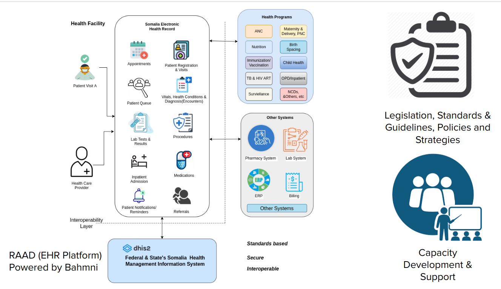

# RAAD System

The RAAD system is an electronic health record (EHR) and a hospital information system designed to digitilize patient management and healthcare delivery at the point of care, ultimately enhancing the quality, efficiency, and cost-effectiveness of healthcare services. It captures information about who received the services, who provided the services, where the services were received, and what specific care was offered. 

In addition, it is built on [Bahmni Platform](https://www.bahmni.org/), an open-source EHR system, and is highly customizable and configurable to meet the specific needs of different health facilities.

The RAAD system includes the following key modules:

* *Client & Patient Registration*: Allows healthcare providers to register patients and create their medical records.

* *Consultation & Medication/Pharmacy*: Allows healthcare providers to document patient consultations, prescribe medications, and track medication orders.

* *Program Specific Consultation*: Allows healthcare providers to document consultations for specific programs, such as HIV/AIDS or Antenatal care.

* *Laboratory Workflow Management*: Allows healthcare providers to manage laboratory tests and results.

* *Data Management Reports Module*: Allows healthcare providers to generate reports on patient data.

* *Metadata Management Module*: Facilitates healthcare providers to manage metadata, such as the definitions of terms and codes.

* *User Management Module*: Facilates healthcare providers to manage user accounts and permissions.

* *HMIS Reporting Module*: This module allows healthcare providers to generate aggregate summary HMIS reports and integrate with the [Somalia HMIS](https://hmis.moh.gov.so/) (Health Managment Information System).

*RAAD EHR High Level Design*

