#  RAAD EHR End User Guide

## Introduction to RAAD System

The RAAD system is an electronic health record (EHR) and a hospital information system designed to digitilize patient management and healthcare delivery at the point of care, ultimately enhancing the quality, efficiency, and cost-effectiveness of healthcare services. It captures information about who received the services, who provided the services, where the services were received, and what specific care was offered.

In addition, it is built on [Bahmni Platform](https://www.bahmni.org/), an open-source EHR system, and is highly customizable and configurable to meet the specific needs of different health facilities.

The RAAD system includes the following key modules:

* *Client & Patient Registration*: Allows healthcare providers to register patients and create their medical records.

* *Consultation & Medication/Pharmacy*: Allows healthcare providers to document patient consultations, prescribe medications, and track medication orders.

* *Program Specific Consultation*: Allows healthcare providers to document consultations for specific programs, such as HIV/AIDS or Antenatal care.

* *Laboratory Workflow Management*: Allows healthcare providers to manage laboratory tests and results.

* *Data Management Reports Module*: Allows healthcare providers to generate reports on patient data.

* *Metadata Management Module*: Facilitates healthcare providers to manage metadata, such as the definitions of terms and codes.

* *User Management Module*: Facilates healthcare providers to manage user accounts and permissions.

* *HMIS Reporting Module*: This module allows healthcare providers to generate aggregate summary HMIS reports and integrate with the [Somalia HMIS](https://hmis.moh.gov.so/) (Health Managment Information System).


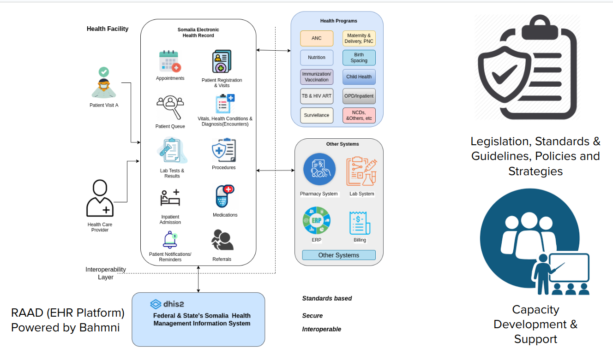

*RAAD EHR High Level Design*


## Clinical Service

### RAAD EHR - Clinical Service 
The Clinical module of the EHR provides the functionality for patient registration, clinical and medication management(triage, diagnosis, prescription, observations, Lab orders ), inpatient management, and report generation.

To access the RAAD EHR landing page, use the EHR URL [uat.raad.moh.gov.so](https://uat.raad.moh.gov.so).

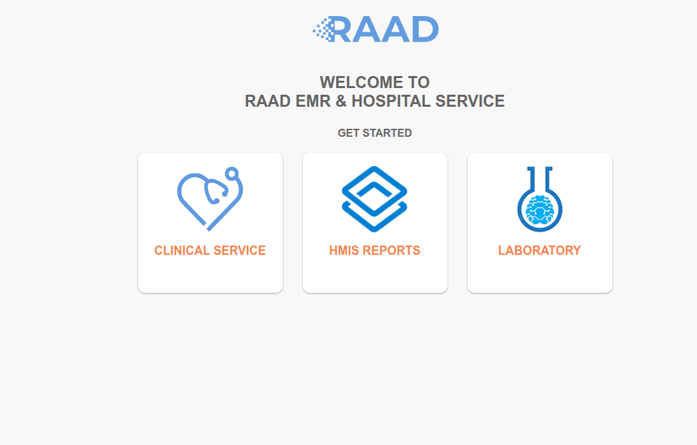

Then click on the Clinical Services Icon

### User Login
The EHR provides user login for the providers who are providing services to the patients/clients.  
For the user to login to the Clinical module, they need to provide their username and password, if they don’t have an access account they will need to request it from the system administrator at the health facility.
The system only allows authenticated users to login. If the user is logging in for the first time, the user will be required to change their password and provide a new password.
In addition, the user will need to select the location they are providing service based on the available options(Service point areas).


* `RAAD username` - Enter Your Username.
* `RAAD password` - Enter Your Password.
* `Location` - Select the Facility Location.


If the user login information is incorrect, the system will let the user know and provide the error message on the login page. If the user error persists, please contact the system administrator for assistance.


On successful login, the system will redirect the user to the Clinical App landing page, and display the available functionalities based on the level of access of the user. 

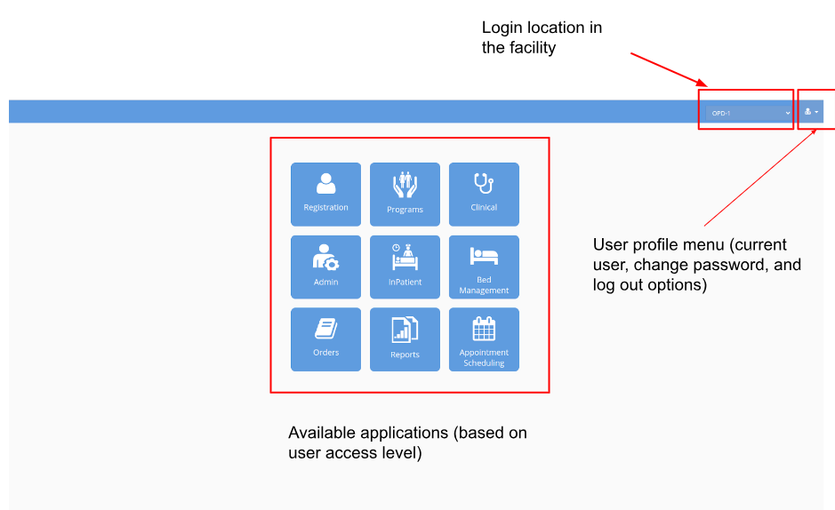

### Registration App
The patient registration app provides the ability to start and edit a patient record at the health facility. It allows users to search for existing patient records, add new patients, edit existing patient records, start or close a patient visit.

*  It provides a patient search based on name, phone number or village

*  It autogenerates a patient unique identifier

*  It allows the patient's address details and any additional information to be captured.

*  It capture relationships between patients and other patients/doctors

*  It allows the printing out of patient identification cards

*  It drives patient workflow based on visit types.

*  It eases facility management by tracking the number of times a patient visits a health facility and the kind of encounters he/she goes through during a       particular visit.

Access the Patient Registration
- On the Clinical App landing page, click on the Registration App. This will direct you to the registration page.

Reference the registration application video walkthrough here -  [Patient Registration](https://youtu.be/jibRpFsEmuU?si=piQMEtujmNJFafPa)


##### Searching for an existing patient.

* `Using ID` - Unique patient identifier
Which is auto-generated by the system upon new patient registration

* `Using other Attributes` - Using either the patient name or phone number or village or a combination of all.

After searching, if there are available registered patients matching the search criteria, the patients will be listed. Then to open a specific patient registration information can be selected from the list. If no patient matches the criteria, the list will have no patient records listed.       
 


##### Adding A New Patient

Please note that before adding a patient to the system, it is essential to conduct a search and verification process to check if the patient has already been registered. This step is crucial to prevent the creation of duplicate records and to ensure data accuracy. 

Information to provide when adding a new patient:

* `Personal Information` - i.e patient’s names, gender, age, date of birth and image profile. Note the field names with a red asterisk on the name are required fields. 

* `Address information` -  i.e state, region, district and village (optional)

* `Additional identifiers` - i.e passport number (Optional)

* `Other information` - i.e  includes contact information i.e email address, phone number(required), next of kin, marital status 

After adding the patient’s details click the Save button which is on the bottom right of the registration page  so as to save the patient’s data.


If one of the required fields is not provided, the system will display an error on the required field


After clicking on the save button a ‘saved’ message with a green background  will pop on top of the registration page as well as a unique patient identifier will be auto generated and the date the patient was added if all te requred attributes are filled.


Upon saving the details, a patient registration card can be generated by clicking on the  ‘Print Registration Card’  button(at the top right corner of the page)

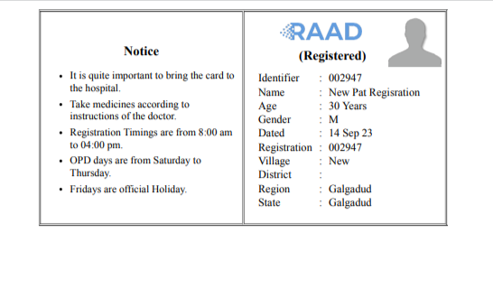


##### Updating Patient's Information

To update a patient's details, you can perform a search using one of the following criteria: their name, their unique patient ID, or their phone number. If there are patients in the system that match your search criteria, their information will be displayed in a list.

* Carefully review the patient information listed to ensure that you are selecting the correct patient for the update.

* Make the necessary updates by editing the appropriate fields with the new information.

* Once you've made the updates, click the 'Save' button. This action will save the updated details in the system.


##### Additional Information

You can add additional information on the last section of the first tab on the registration page which majorly includes the patient’s next of kin contact details, and other additional fields. Note these are optional fields, only the phone number is mandatory.


##### Add Relationships (optional)

The middle area of the registration page has a ‘Relationships’ section, which upon clicking has a drop-down box with three types of relationships i,e doctor,sibling and parent and you can add the next of kin relationship with the patient. After selecting the relationship, search using the patient name or patient unique identifier to link the relationship. Once you confirm all the details are correctly mapped, save the record. Note the patient record can only be linked to patients or providers already existing in the system.

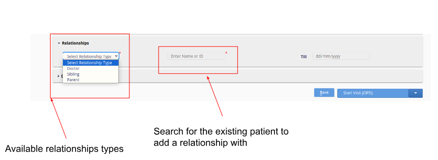


#### Starting and Closing Patient Visit

##### Starting Patient Visit

A patient visit encompasses the entire process of a patient's interaction with a healthcare facility, from registration and triage to clinical assessment, treatment, and other encounters. Eg. laboratory, and inpatient etc. A visit type is the categorization or classification of patient visits based on the purpose or nature of the appointment. This is different from one EPHS facility level to another. 

To start a visit, on the registration page(located at the bottom right, just beside the 'Save' button), there is a 'Start Visit' button with a drop down of different visit types.


The Start visit types includes: 

* OPD (Outpatient)

* PNC (Postnatal Care)

* Nutrition

* Pharmacy

* Delivery

* Laboratory

* EPI (Immunisation)

* ANC (Antenatal Care)

* VCT ( Voluntary Counselling and Testing)


* Select the appropriate visit type, when clicked, this button will automatically update the patient's status to 'Started Visit' after their registration.
* On the preceding page, click “Save”, and the patient visit will be active.  
* When the visit is active, the patient can access services on the clinical, program and inpatient modules.


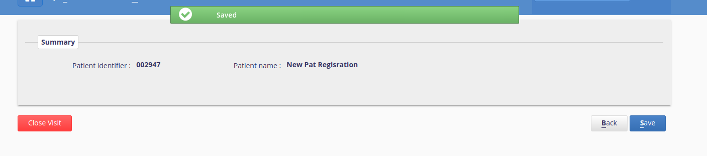

##### Closing Patient Visit

Closing a patient visit means the patient won’t be active on the clinical queue or available to receive services. This should be done once a patient visit or patient encounters with the clinicians have been completed. If not closed, the system will automatically close the visits at the end of the day(at midnight).

If the patient has already begun their visit:

* On the patient registration page, the 'Start Visit' button changes to 'Enter Visit Details.'

* Click the 'Enter Visit Details' button.

* A summary of the patient's visit will be displayed.

Click the 'Close Visit' button, which has a red background.

A message will pop up on the page, inquiring, 'Are you sure you want to close this visit?'

* Click the 'OK' button in the popup menu to confirm.

* Alternatively, click 'Cancel' to close the popup without taking any action.

Once the patient visit is closed, the patient won’t be accessible on the clinical patient queue. 


### Clinical Application

This is a core module and serves multiple purposes, including viewing the treatment history of existing patients, initiating consultations and treatment for registered patients. It can be conveniently accessed through the 'Clinical' app on the system's landing page.

Additionally, this module facilitates searching, viewing, and editing patient observations, placing lab requests, recording patient diagnoses and conditions, and dispensing medications to patients. It's important to note that the clinical module is specifically designed for patients who currently have an active visit.

Reference the clinical consulation walkthrough here - [Clinical Consultation Workflow](https://youtu.be/Kj9Y1XAOqDU?si=QiBWCLVTvaIuhqWJ)

##### Clinical Patient Queue

It contains different patient queues for patients having an active visit at the health facility. The different queues are based on the patient's visit type.  Note, for patients admitted they will always be active until they are discharged. 


##### Patient's Dashboard

It contains the patient's information summary from the date of their first recorded visit and it aids in capturing and documenting various types of observations, encounters, diagnosis, treatment and assesments to a patient’s medical health record.

It highlights the patient demographics,  history and contains the patient's previous and active visits and earlier diagnosis and treatments provided. 

It is accessed by clicking a specific patient with an active visit on the clinical patient queue.


On the patient dashboard, there are quick access links to facilitate easy navigation between different pages.
 The quick access links include:

* Home Dashboard, goes back to the landing page of the clinical service.

* Patient Visit Page, to view detailed information of the patient's previous hospital visits.

* Patient ADT page, to view the patient admission page and perform actions to either admit or discharge the patient.

* Visit Attributes, to go to the patient start visit page. 

* Registration, to go to the patient’s registration information for view or updating.

* Lab entry, to go to the lab entry window for the specific patient lab tests


##### Observation Forms

###### Vital Information Forms

It is an observation form used to record a patient's vital signs and essential physiological measurements that provide important information about their overall health and well-being.

It can be accessed by clicking on the  “Consultation” button on the top right corner of  the patient’s dashboard page.


* After completing to fill the form you will need to click  the  ‘Save’ button on the top right corner  so as to save the details.

* Upon successful saving the system will generate the date the information was recorded on the side panel beside the form name.

* If there’s a validation error, the system will display the error on a pop up window and highlight the specific fields with issues for the user to look into and capture the information correctly. 


###### History and Examination

It is used to gather comprehensive information about a patient's medical history, current health status, and the findings from a physical examination. 

This form is typically used by healthcare providers, including physicians, nurses, and other clinicians, to guide their assessment and diagnosis of a patient's condition.

It can be accessed by clicking the ‘Add New Obs Form’ button on the observations page, 
then on the observation forms available will be listed. 


For one to view the history and examination form, you will need to click it on the displayed table for an empty form to be shown.

Then fill the form of the patient’s health complaint together with the history and the examination notes.


On the Chief complaint data section after filling in the patient’s symptoms/signs and on clicking the accept button which is in the same section, a drop-down button with various options i.e hours,days,weeks will be generated on how long the patient has been having the symptoms or the complaints.

If the patient has more than one complaint you can click on the add icon at the end of the segment to add them.

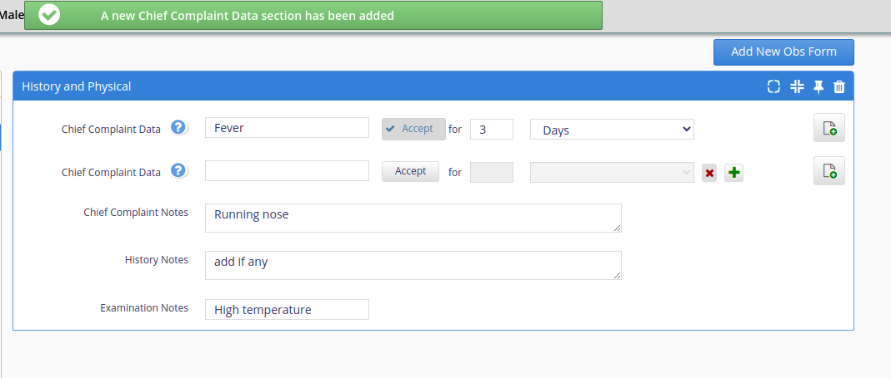

After completing filling  the form, review and verify that the information added is correct then save the form.


###### Other Observation Forms

Other Observation forms (Obs) available, and to be filled during a patient encounter while receiving a specific service include:

* Delivery 

* NewBorn

* Discharge

* Birth Spacing

* Infant Visit

* Mother PNC Visit

* Immunisation

* ANC 

* ANC Visit

* OPD

* PNC
  
* TB Screening Form
  
* TB Diagnosis
  
* Nutritional Assessment
  
* OTP Follow Up
  
* TSFT Follow Up

Capturing information on the observation forms follows the same process. 


```OPD Observation Form.``` 

 The Outpatient Department (OPD) Observation Form is used to record patient observations during their visit

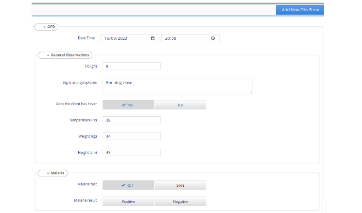

```Delivery Form```

The Delivery Form records details of childbirth, including maternal information, delivery type, newborn condition, and any complications, ensuring comprehensive documentation for postnatal care.


```PNC Form```

The PNC Form documents postnatal care details, including the mother’s recovery, newborn health, and follow-up care, ensuring holistic monitoring after delivery.

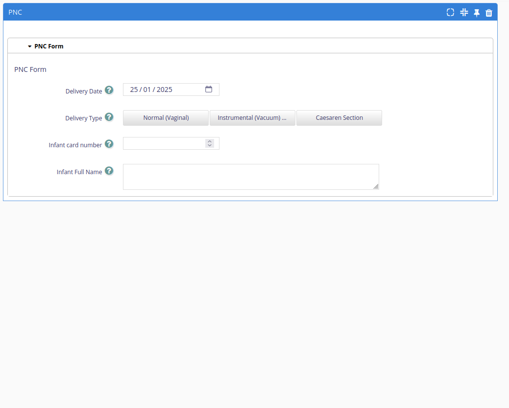

```Newborn Form```

The Newborn Form documents key information about a newborn's health, including birth details, physical assessments, feeding, immunizations, and any immediate medical interventions needed.


```Discharge Form```

The Discharge Form records patient details, diagnosis, treatment summary, and follow-up instructions, ensuring a smooth transition from hospital care to home or another facility.


```Immunization Form```

The Immunization Form tracks patient vaccination details, including administered vaccines, dates, dosage, and follow-up schedules, ensuring proper immunization records and compliance.

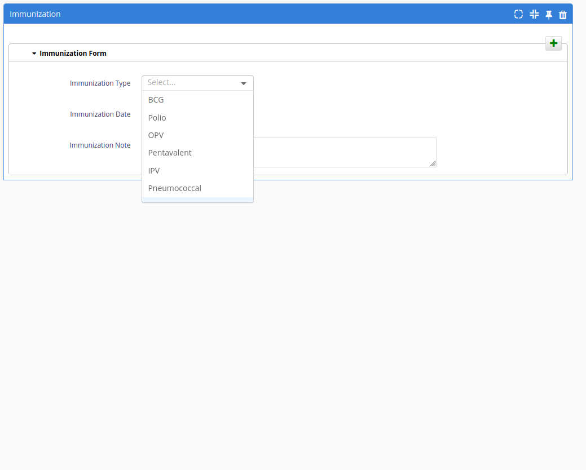

```Infant Visit Form```

The Infant Visit Form records key details of an infant's health check-up, including growth metrics, developmental milestones, feeding patterns, immunization updates, and follow-up recommendations.

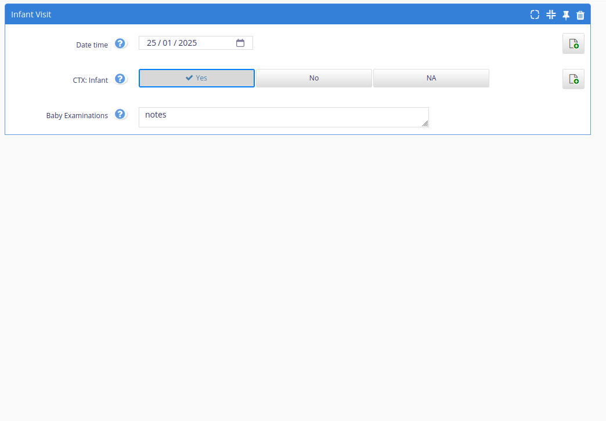

```Birth Spacing Form```

The Birth Spacing Form records counseling details, chosen methods, and follow-up plans.


```Mother PNC Visit```

The Mother PNC Visit Form captures details of the mother's health post-delivery, including physical recovery, mental well-being, breastfeeding progress, and follow-up care recommendations.

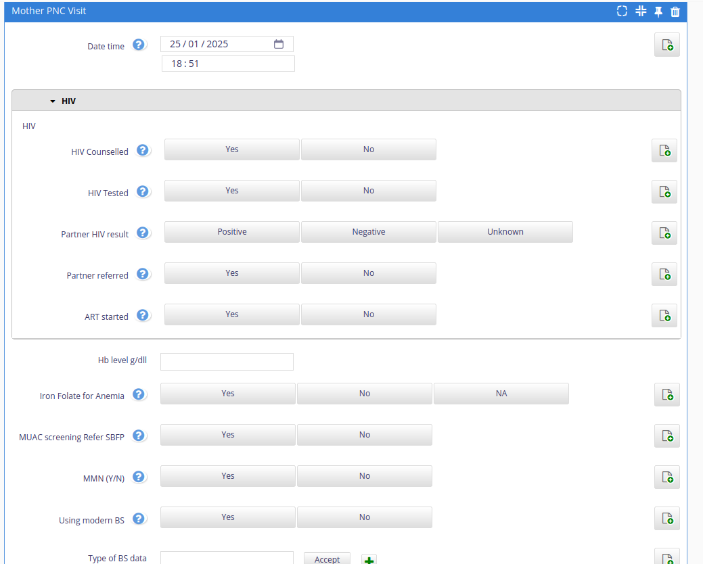

```ANC Visit```

The ANC Visit Form records details of antenatal care visits, including maternal health assessments, fetal development, lab results, and any advice or interventions provided during the pregnancy.


```TB Screening Form```

The TB Screening Form documents patient symptoms, risk factors, and test results to assess the likelihood of tuberculosis, ensuring timely diagnosis and intervention.


```TB Diagnosis Form```

The TB Diagnosis Form records the results of diagnostic tests, such as sputum smears or chest X-rays, and confirms the presence of tuberculosis, and treatment decisions.


```Nutrional Assessment Observation Form```

The Nutritional Assessment Observation Form is used to evaluate a patient's nutritional status and identify any deficiencies or related health concerns.

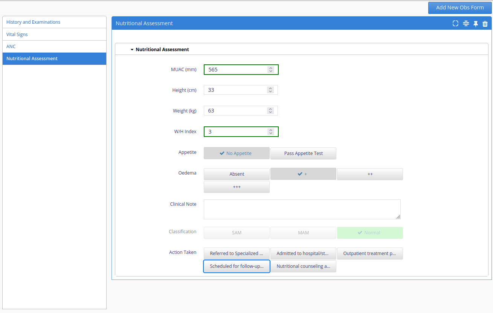

```SC (Stabilization Center) Follow up Form```

The SC(Stabilizarion Center) Follow-Up Form tracks the progress of patients from the Stabilization Centers.

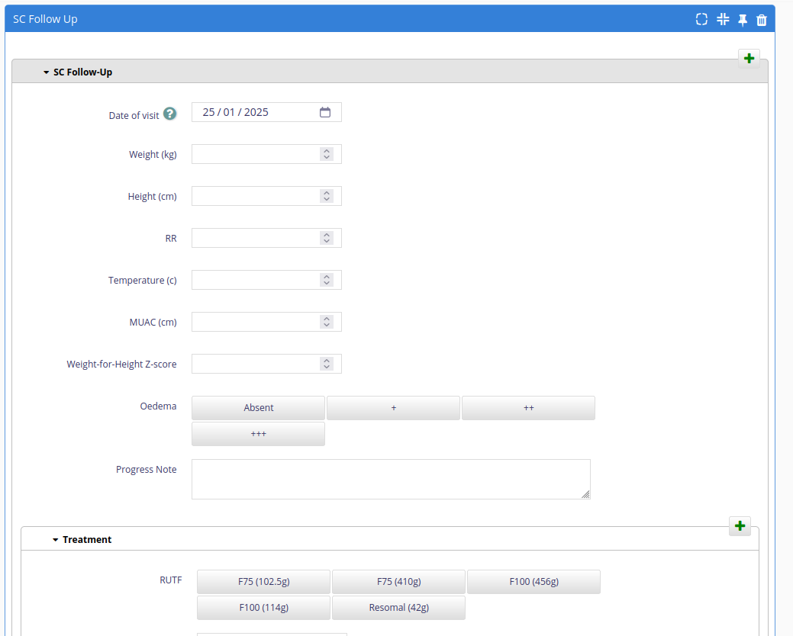

```OTP Follow up Form```

The OTP(Outpatient Therapeutic feeding) Follow-Up Form monitors the progress of patients enrolled in Outpatient Therapeutic feeding Program.


```OPD(Outpatient) Form```

The OPD(OUtpatient) Form records patient details during an outpatient visit, including the reason for the visit, clinical findings, diagnosis, prescribed treatments, and follow-up.

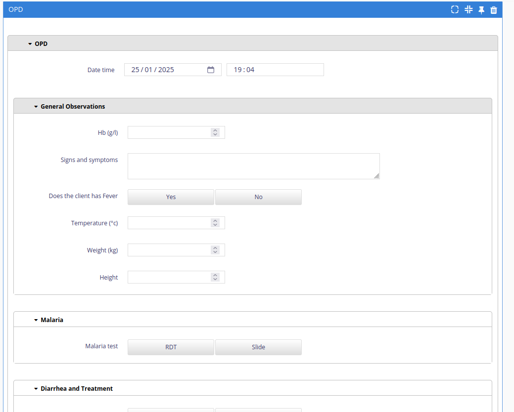

```VCT Form```

The VCT Form (Voluntary Counseling and Testing) records patient information, counseling sessions, and HIV test results, ensuring confidentiality and follow-up care for those undergoing HIV testing and counseling.

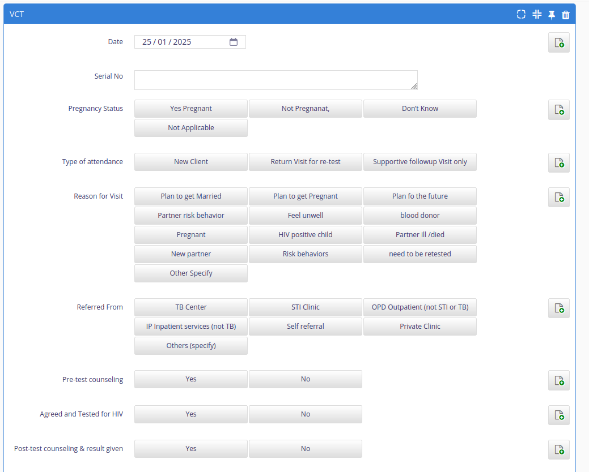

```TSTP(Targeted Supplementary Feeding Program) Follow up Form```

The form captures follow up records for patients on the targeted supplementary feeding program.

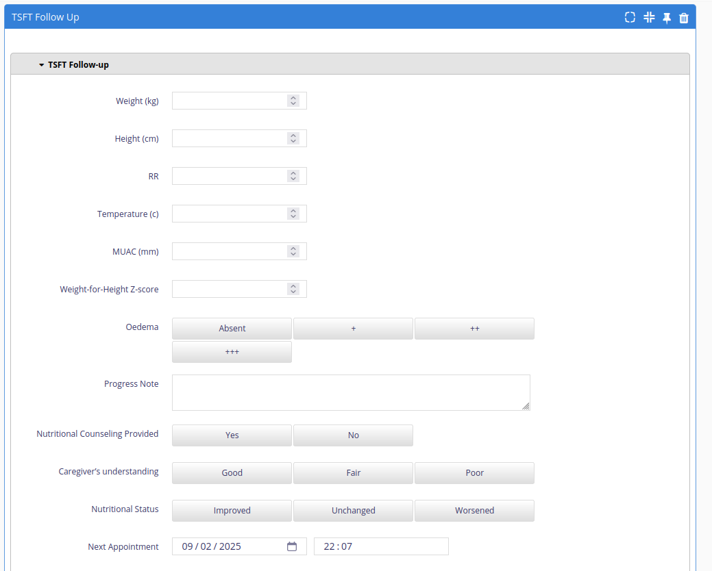

##### Consultation Notes

They are the notes captured by physicians/specialists that highlight crucial information about a patient's medical condition based on the observations, examinations, and lab test results if conducted. 

It is accessed from the patient's dashboard, by clicking the ‘Consultation’ tab.

It incorporates the saved observations’s forms data to ease the writing of the consultation notes


After consultation notes have been added,  save the consultation notes using the save button on the top right corner of the page.


##### Laboratory Orders

It consists of the lab test catalogue which includes  test names, test codes and test requirements and the tab is to be operated by lab technicians.

It is accessed from the  patient’s dashboard by clicking the ‘Laboratory orders’ tab.


On selecting the tests to be run on the patient the system displays the selected tests at a window on the bottom left corner of the form and after verification those are the tests to be performed click on the save button to save  the details 


##### Diganosis Module

It is a module designed to manage and document the diagnosis and clinical assessment of patients. It plays a critical role in the healthcare workflow by allowing healthcare providers to record and access diagnostic information efficiently. It can be accessed from the fourth tab on the patient’s dashboard 
with a ‘Diagnosis’ title.


After completing filling the information which includes the patient’s diagnosis and conditions,  save the information provided.

Please note the capturing of the diagnosis and condition information will be based on ICD11 coding. 

Reference the diagnosis module walkthrough here - [Diagnosis Module](https://youtu.be/9ElmkEL9KGE?si=mZa-3nEv6tYnv_go)

##### Drug Module/Pharmacy Module/Medication Module

It is a specialised component designed to manage and streamline pharmacy-related tasks and information within a healthcare facility. This module plays a crucial role in ensuring the safe and efficient delivery of medications to patients. It can be accessed from the fifth tab on the patient’s dashboard with a ‘Medications’ title


After the prescription has been added, the pharmacy user will dispense the medication to the patient by clicking "dispense all” or specifically selecting “D” on each prescription then saving.
In addition, the module supports electronic prescribing (e-prescribing) of medications to external pharmacies, improving efficiency and accuracy in prescription processing.

Reference the medication prescribing and dispensation walkthrough here - [Drug Presciptions and Dispensations](https://youtu.be/9ElmkEL9KGE?si=mZa-3nEv6tYnv_go)


##### Disposition Module

It refers to a component that focuses on documenting and managing the disposition of patients after they have received care or undergone assessment in a healthcare facility.
 The disposition represents the outcome of a patient's visit or encounter. This module helps streamline the process of deciding and documenting what happens to the patient next  i.e 
* Discharge

* Admission

* Home care 

* Referral

* Follow-up appointment

It can be accessed on the last tab on the patient’s dashboard with the title “Disposition”.

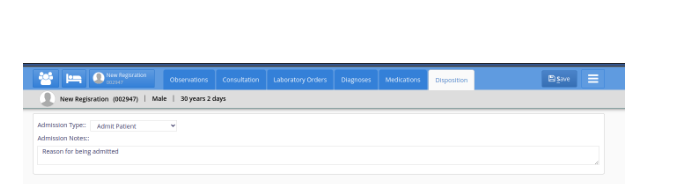

### Program Module

A component within an Electronic Health Record that supports the management and monitoring of specific healthcare programs or initiatives. These programs can encompass a wide range of healthcare activities, from disease management and prevention to quality improvement and research. Currently the programs setup are Immunization and Antenatal care.
It can be accessed from the home dashboard with the ‘Programs’ app menu button.


On the text input you can key in patient’s ID for ease in retrieving the patient's data

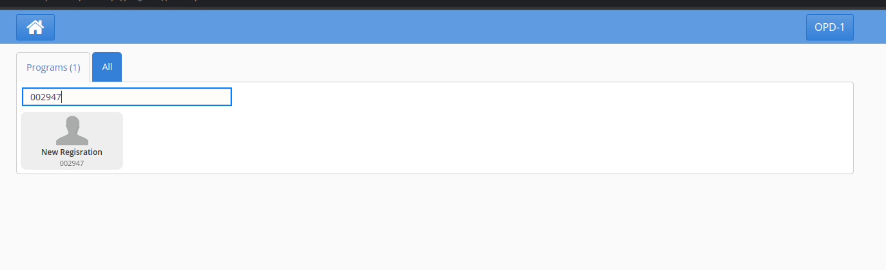

Then click on the patient.
 On the program landing page click the ‘New Program Enrolment’ tab with an add icon to enrol the patient in available programs 


The programs available will be available in the drop down element then chose the start date for the program then enrol the patient to the program


The system will generate the new program, the patient has been  enrolled to, dashboard. In the active programs category

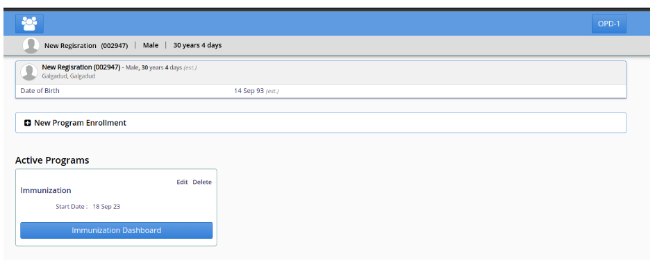


### Inpatient Module

An application within the EMR  designed to manage and document the care of patients who are admitted in a healthcare facility. This application plays a key role in ensuring comprehensive, real-time, and efficient care for in-patients
Can be accessed from the home dashboard with the ‘Inpatient’ app menu button.


#### Admitting Patient

   To admit a patient you click on the ‘To Admit’ tab on the page and search the patient with the patient ID attribute to be admitted then click on the patient and you will be directed to patient dashboard  then click on the admit button after filling in admission details


Then you will be directed to assign the patient the available vacant bed. 


Then click on assign and a message will pop up indicating the bed was assigned successfully


On the admitted patient’s tab the patient will be added automatically that they have been admitted with a bed icon on the side

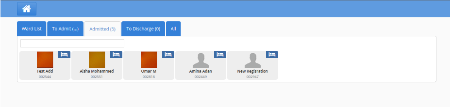


#### Discharging Patient

You will follow the same steps as admitting a patient only that on the InPatient homepage you will select on the ‘To Discharge’ button  then click on the discharge button on the inpatient dashboard


#### Transfering Patient

Follow the same steps then select on the the transfer button then click on save 


### Appointment Scheduling
A feature within the RAAD EHR system that enables healthcare providers to efficiently manage patient appointments. 
It streamlines booking, rescheduling, and cancellations while providing an overview of available slots and practitioner schedules.


Clicking on the ```Appointments List``` directs you to a new page where you can:

* Make a New Appointment: Easily schedule a new appointment using the booking form.

* View Appointments in Calendar View: See all scheduled appointments highlighted in a calendar format for better visualization and management.

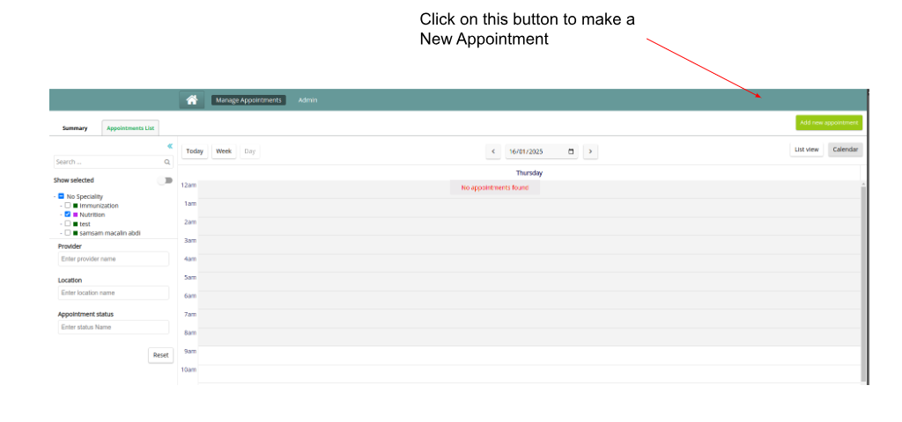

#### Adding An Appointment


To book an appointment: 

* Enter Patient Information: Provide the patient's name or ID.

* Select Specialty: Choose the relevant medical specialty.

* Choose Clinical Visit Type: Specify the type of visit (e.g., Vaccination, nutrtion, or test).

* Select Provider and Location: Pick the healthcare provider and the location where the appointment will take place.

* Fill in Appointment Date/Dates and Time: Select the date or dates for a recurring appointment and the time for the appointment.


#### Walk-in Appointment

A one-time, unscheduled appointment made on the spot when a patient visits the facility without prior booking.

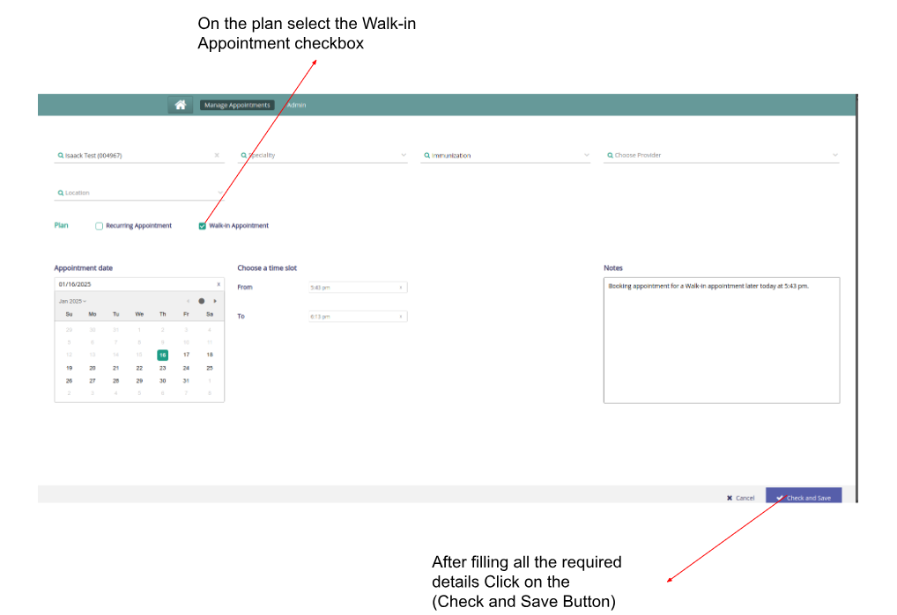

Validate all details before finalizing the schedule then click on the save button.

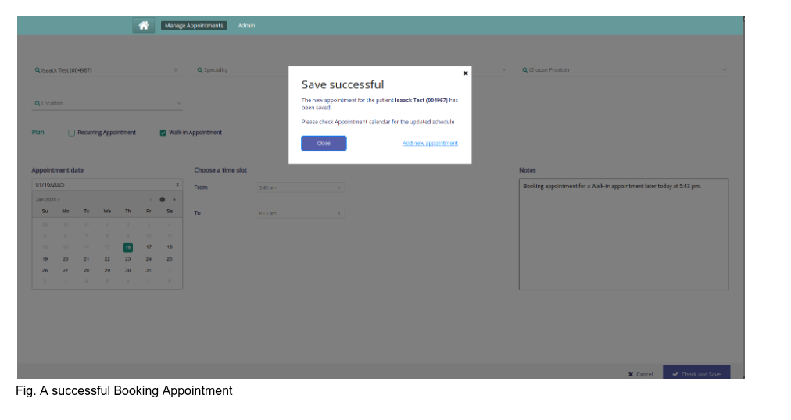


#### Recurring Appointment

A series of pre-scheduled appointments for the same patient, occurring at regular intervals (e.g., weekly or monthly) to address ongoing care needs.


Back on the Appointments List page the appointments will be highlighted at the time and date in a calendar view.

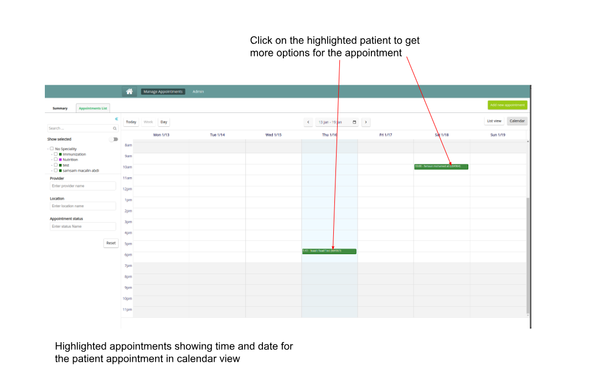

When selecting a patient, you can perform the following actions:

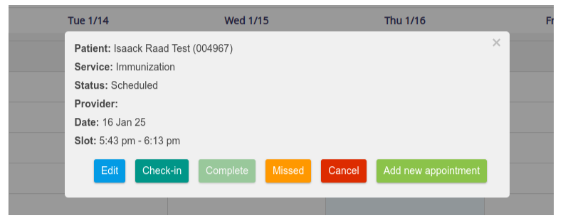

* Edit Appointment: Update the details of an existing appointment.

* Check-In: Mark the patient as arrived for their appointment.


* Complete: Mark the appointment as completed after the visit.


* Mark as Missed: Indicate that the patient did not show up for the appointment.


* Cancel Appointment: Remove the appointment from the schedule.

* Make a New Appointment: Schedule a new appointment for the patient.

#### Adding A Service
Click on ```Admin``` to be directed to the services page. The Available services will be displayed in a table like format with the:

* Service Name - Enter the service name (e.g., Consultation, Imaging)

* Speciality - Providers qualified to offer this service.
  
* Duration - Indicate the time required for the service.
  
* Description - Provide a brief summary of the service.

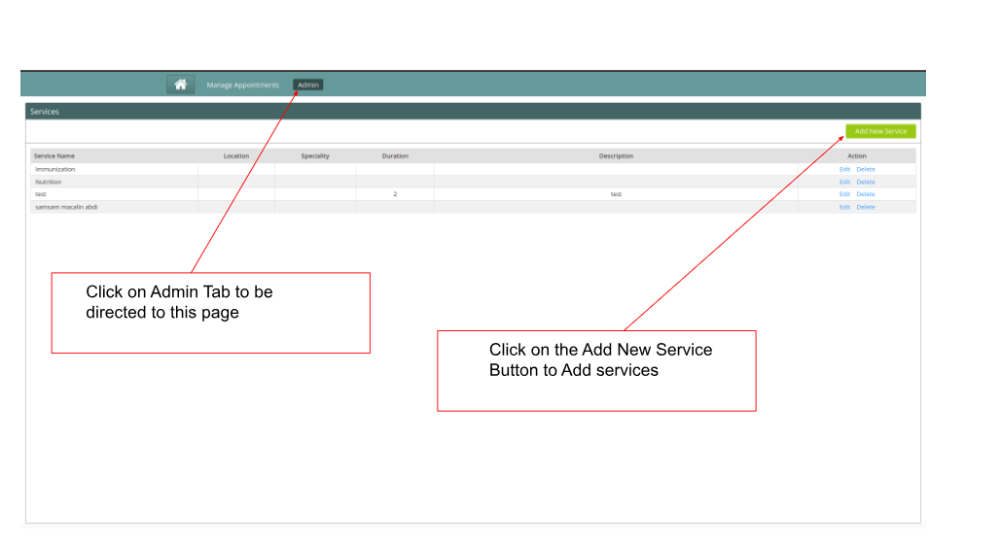

Click on the ```Add New Service``` Button to be directed to the adding a new service form.


You can specify the service's availability by selecting the days and times it is offered in the facility. Additionally, set the maximum number of patients the specialty can handle during those times. This ensures efficient scheduling and better management of resources.


## Laboratory Module

The laboratory platform is built on the open source laboratory information systems (OpenELIS)  that provides different lab management features and workflows, and seamlessly integrates with the electronic medical record system. 
To access the Laboratory platform, click on the “Laboratory” app on the landing page using the following URL 
[uat.raad.moh.gov.so](https://uat.raad.moh.gov.so).

Reference the Laboratory walkthrough here - [Lab Workflow](https://youtu.be/bdpHGbUU0ZM?si=sl92KPqTqWFipf5z)

For the user to login to the Laboratory  module, they need to provide their username and password, if they don’t have an access account they will need to request it from the system administrator at the health facility.

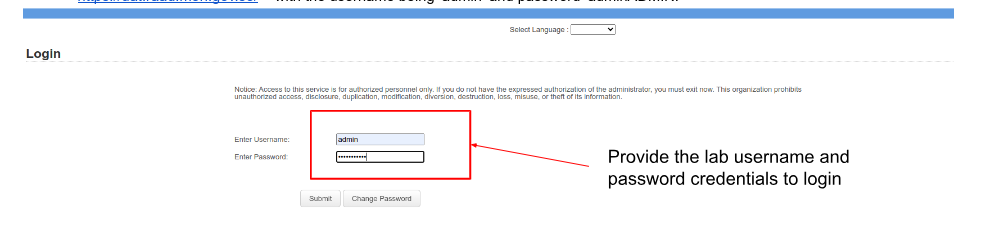


If the user login information is incorrect, the system will let the user know and provide the error message on the login page. If the user error persists, please contact the system administrator for assistance.

### Receiving Lab Orders

This component  focuses on the process of receiving and managing lab orders from healthcare providers.
After saving Laboratory Orders within the Clinical Module of the EHR system, it automatically initiates requests  in the Laboratory  Module for the collection of the patient's sample/samples.

Can be accessed as the first page after logging in the Laboratory platform, the Lab Dashboard

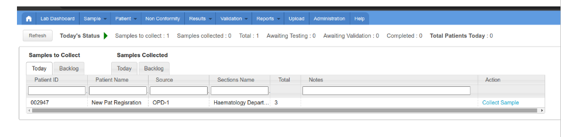

### Collecting Samples 

It is a streamlined component designed to facilitate the efficient and accurate collection of patient samples for laboratory testing. This sub-module is integral to the laboratory workflow and ensures that the right samples are collected from patients for diagnostic purposes.

Can be accessed in two ways:

* By manually searching  using the patient’s ID or name attributes in the text input area from the lab dashboard.If the request was made today search in the today’s entity, else search in the backlog entity.
After accessing your patient’s data at the end of the table section in the Action attribute click on the ‘Collect 
sample’ action styled in colour blue. The lab samples to be collected will be generated in the add sample form 

   

* By clicking on the ‘Sample’ tab in the navbar section of the page and from the drop-down in the tab click the add sample button

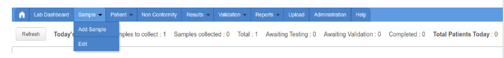

Then you will be directed to the add sample page where you will run a manual search to find the patient details 


If the patient wasn’t directed from the clinical module for sample’s collection you will be required to add samples to be collected manually  which is mandatory .
After filling the samples to be collected, at the bottom section of the form with the ‘Order’ title you will be required to add an accession number or generate it automatically

Then on the sample source option you will select from a drop down box-element  *


Then you will be required to save the details after verifying the collected samples are correct.
The accession number uniquely identifies the samples taken at the laboratory. 


### Providing Results

It is a specialised component designed to efficiently deliver and manage the results of medical tests and diagnostic procedures to healthcare providers and patients.

It is accessed from the top menu section on the specific menu labelled  ‘Results’, then selected on the way to search for the results either by Patient, Accession or Status . Searching by patient attributes  is the most recommended option to use 

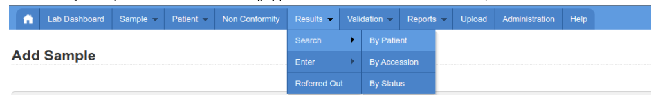

After being directed to the results page run a manual search for the patient, then click on the  ‘Get Tests For Patient'  tab on the page   for the test form to be generated


Then the specialist will fill the form with the tests result  done at the facility


If the facility can’t facilitate some tests to be done which are crucial, the patient will be referred to an external lab
And at the test will be indicated the patient was referred out and one also can attach a copy of the results from the external lab as well as additional notes for the reason for being referred out to an external lab 


Then you will be prompted to save the test results from the save button at the bottom of the page

When the patient will be back with the results, one will be required to upload the results and a lab report file.

To file the results on the results tab now you will click on the ‘Referred Out’ button and add the results then save thereafter


### Validating Results

This is a crucial step in the laboratory testing process to ensure the accuracy, reliability, and integrity of test results before they are reported to healthcare providers and patients. 
The page can be accessed on the ‘Validate’ tab on the menu bar


The user will be prompted to either accept, reject or indicate the results are abnormal and on the side one can add additional notes for option selected. Then click on save after validation.


On the Lab dashboard, you will be able to view the samples collected on that day and actions that can be peformed on the samples(provide results, validate, or print results, or generate an accession number). 

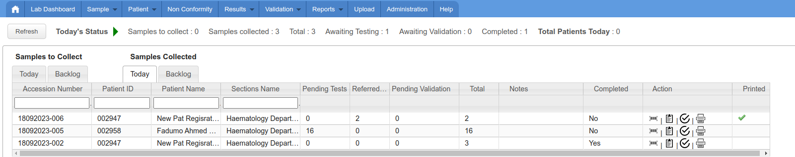

You can print the Lab report  of the patient by running a manual search of the patient using various attributes and then clicking on the print icon at the end of the Action column and the report will be generated 


## Reports Generation

### Reports App

A sub-module designed to generate and manage various types of patient level register reports. These reports are crucial for healthcare providers, to access, analyse patient data, and track healthcare outcomes.

It can be accessed from the clinical services dashboard by clicking the  ‘Reports’ app menu button.


To generate a register report, select the report, then provide the start and end date, then select the format to generate the report either pdf, html, csv or xls, then click on either Run now or Queue.

Previously generated reports or queued reports can be accessed  on the ‘My reports’ tab, search for your reports and then choose the format  to download your reports on.


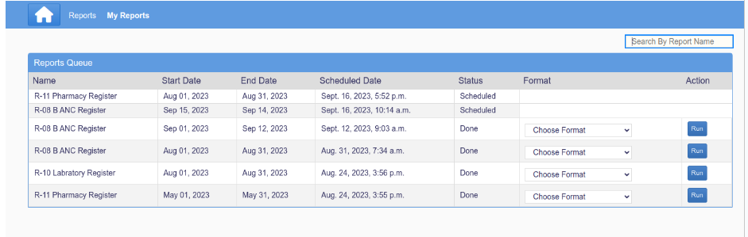

### HMIS Reports

* It is used to generate aggregated monthly HMIS reports and then submit the reports to the HMIS platform.

* The user requires HMIS credentials to login the HMIS reports app.

* The user can preview and download the reports summary for each of the generated HMIS reports from the EMR.

* The user can submit the summary information to the HMIS platform after review.


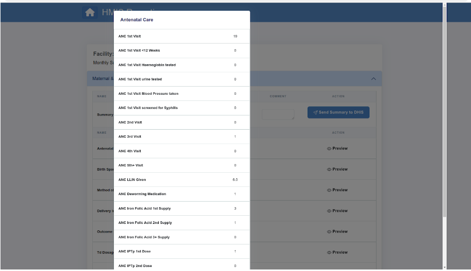

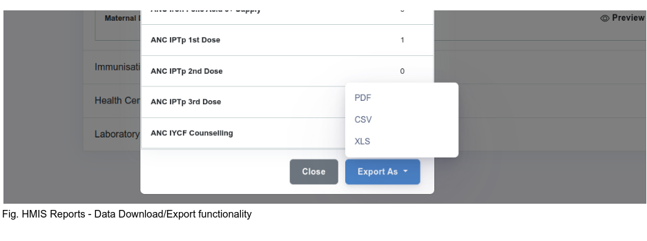

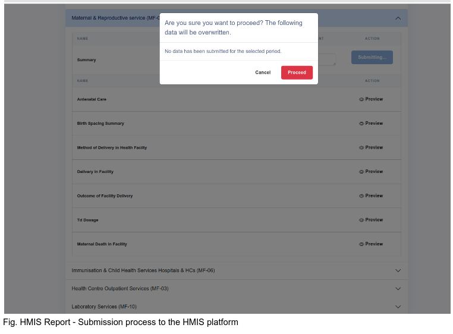

## User Management 

### Clinical Service - User Management

To add or update user information on the RAAD Clinical Service, the user administrator will be required to use the OpenMRS login page. It can be accessed using the namespace /openmrs/ on the main system URL. 
> For example, on the UAT environment, it can be accessed here 
 [uat.raad.moh.gov.so/openmrs](https://uat.raad.moh.gov.so/openmrs)


The user management module facilitates

* Addition of new system users and allocation of appropriate roles.

* Updating system users’ information.

* Resetting user's password.

* Disabling a user account.

The user management module allows seamless user administration, and ensuring only users granted permission can login into the Clinical Service Application. It controls what an authenticated user can view or what action they can perform in the system.


#### Login as a User Administrator

To login, provide the login credentials, the user must have administrator privileges so as to gain access.


After successful login into the system, the user  will be directed to the OpenMRS landing page.


#### Managing Users

To create users, you will navigate to the Administration page on the title bar of the OpenMRS homepage, 
and select “Manage users” link

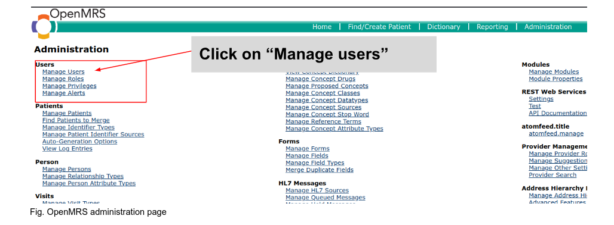

The user  will be directed to the “Manage Users” page and then they will be required to click the ‘Add user’ link on the page.

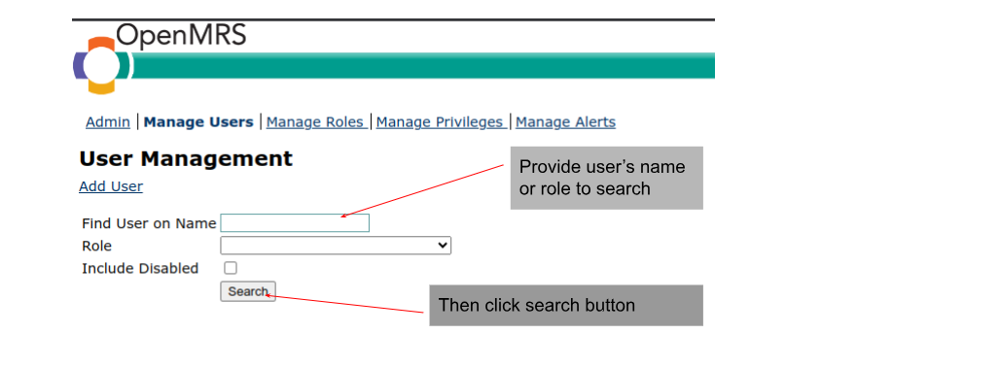

On the Add user page, the user will have two options to either add a new user or use an existing person in the system already
You will be required to search for the user in the system first before adding  the user to ensure the user does not exist in the system. This prevents duplication of user accounts in the system, and makes it easy to manage user accounts in the system. 

##### Adding a New User 
 Click on the “next” button with “create a new person” title.  


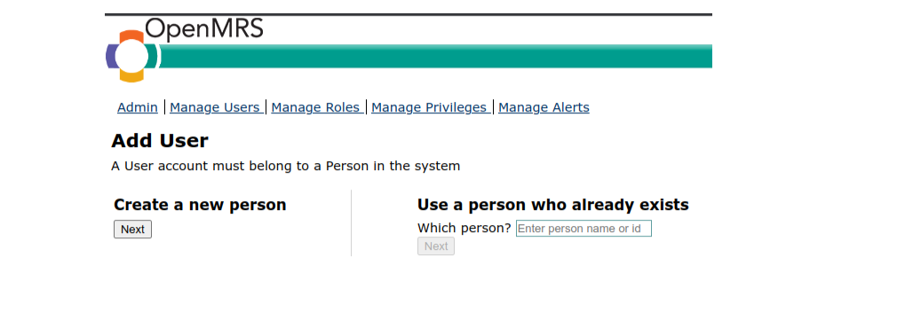


Information to provide when adding a new user:

* Demographic  information - i.e user’s name and gender. Note the field names with a red asterisk on the Given name and gender are required fields. 

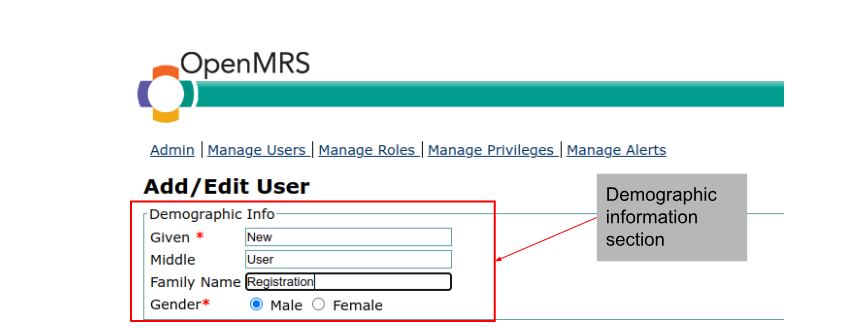

*  Provider Account Section - Then the user will select to create a provider account for the user. 

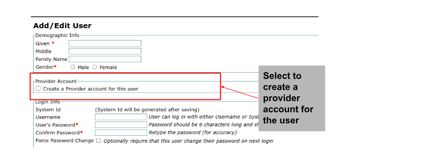

* Login Information section

On the login info section, you will have to provide a username and create the user’s password and confirm the new password provided and assign  the new user’s roles based on the level of access they should have in the system.

If you want the user to change the default password immediately after login in, select the “Force password change” button.

Note the password policy for user accounts. ( The password should have at least 8 characters long and should have both upper and lower case characters, at least one digit, and at least one special character)

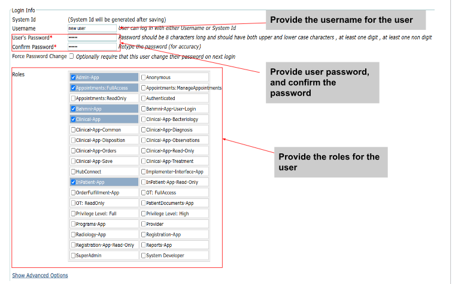

On the lower section of the login info section there is a hidden advanced options link and upon clicking “Show Advanced Options”,  additional security questions will be displayed where one can enhance the security of their login credentials by providing secret questions and answers(optional).

 This can be reused when the user has forgotten their password, and they want to reset their credentials. then click on the search button. 

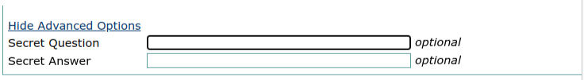


Upon completing filling the form click on the ‘Save User’ button on the bottom of the page.

Once the information has been successfully saved, the user can login in on the Clinical Service App with the credentials provided. 


If there arises any errors when saving, a pop up message will be displayed on top of the page displaying the errors to be corrected


If you have correctly added or updated a user information, a pop up message will be displayed highlighting the user has been saved successfully


#### Updating User's information

You will go to manage users page, then you will search for the specific user to update information for using the provided search attributes (either the name or a specific role).
Then click on the specific user’s  system id on the search results table to be directed to the user information form where you will be able to make the updates. To save the information, click on save, and the user’s information will be updated. 

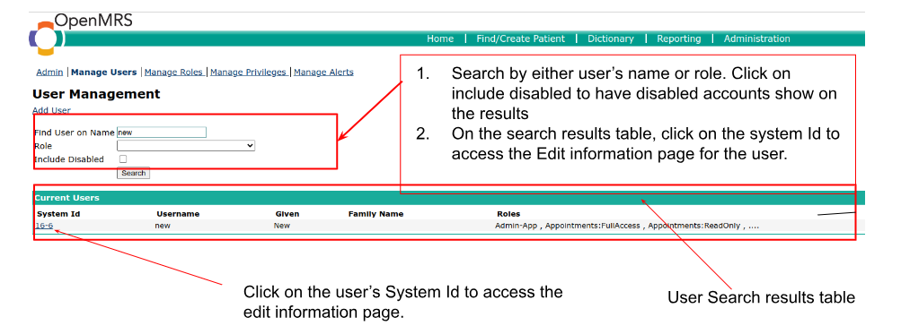

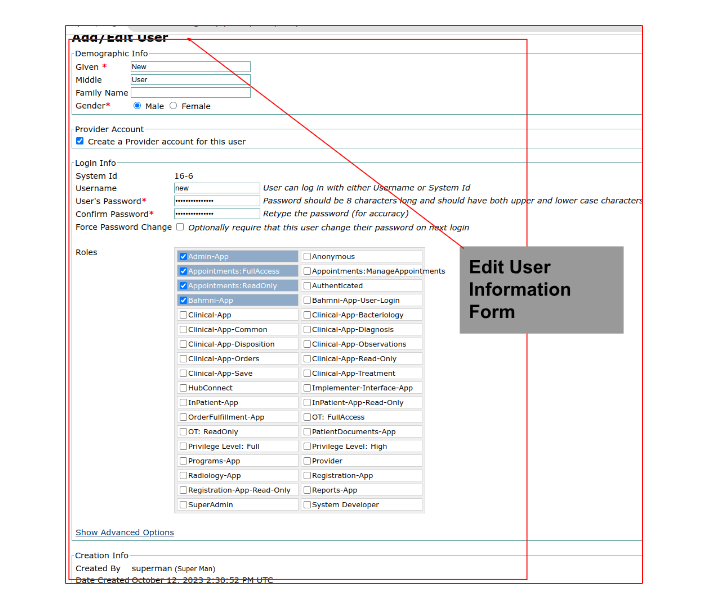

#### Changing/Resetting a User’s Password

Search for the specific user to change/reset password on the “manage user page”, then click on edit the user information. Update the user information with the new password and confirm the password, then save the form. This will automatically update the user password with the new provided password.

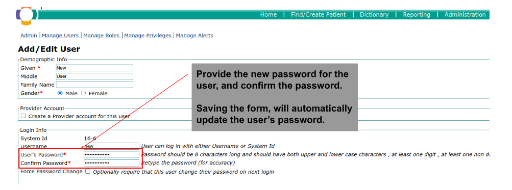

#### Disabling/Enabling an User Account

Search for the specific user account to disable on the “manage user page” , then on the disable account section on the user information form, provide the reason to disable the account then click on the disable button to disable the user.

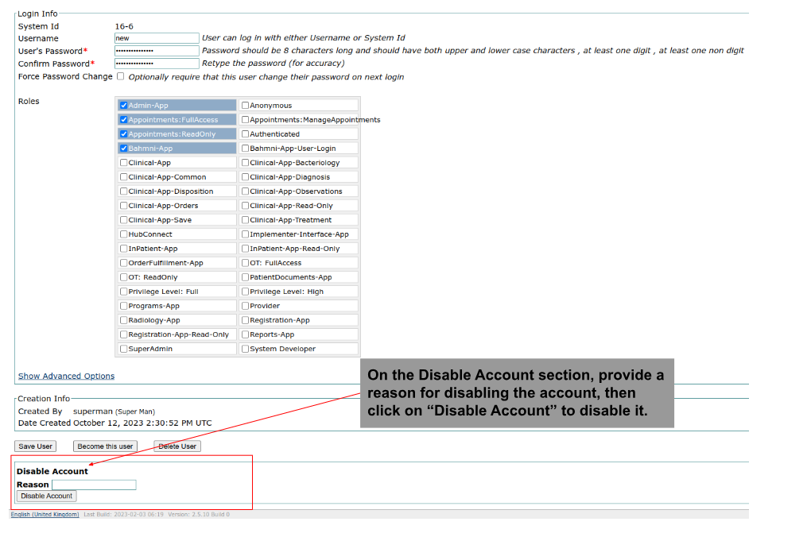

#### New User Account Login

The new user will be required to use the credentials provided by the user administrator for the first time when logging in: 

* Username

* Password (change the password immediately after logging in)

* Select the login location 

If the force password change option is selected, it will require the user to provide a new user password. 
If the system does not request for password change, it is required for the user to change their password immediately after logging in for the first time to ensure the security of their user account.

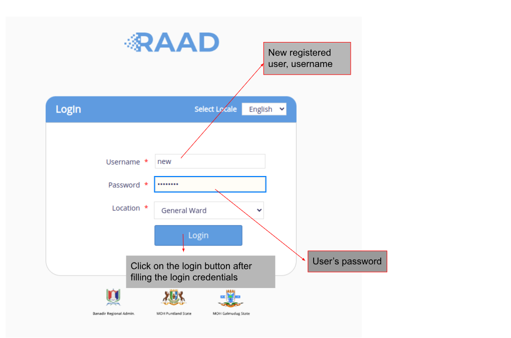

#### New/Existing User Changing Password

After successful  login, click on your user profile icon which is located at the top right section of the Clinical Service landing page. 
Then click on the change password button(with a key icon) from the dropdown menu.


### Laboratory Platform - User Management

It allows the system administrator to manage user accounts for administering services on the Lab platform. Note the credentials for the lab platform are different from the Clinical Service platform. 

The user management module on the laboratory platform facilities

* Adding/creating new lab users.

* Editing existing users information.

* Deactivating/Activating user account.

* Unlocking user accounts.

* Updating and resetting the user's password.


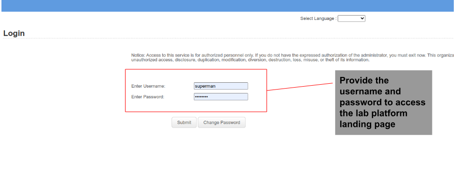

To manage users in the platform, click on the Administration on the top menu. 

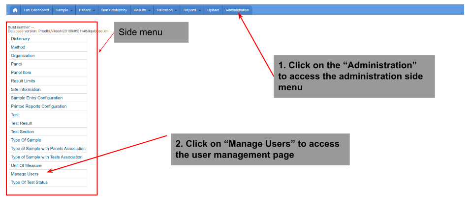

On clicking “Manage Users” on the Administration page, the user will access the user management page.


#### Creating a Lab User

To add a new system user into the laboratory platform, click on the “Add” button on the user management page.

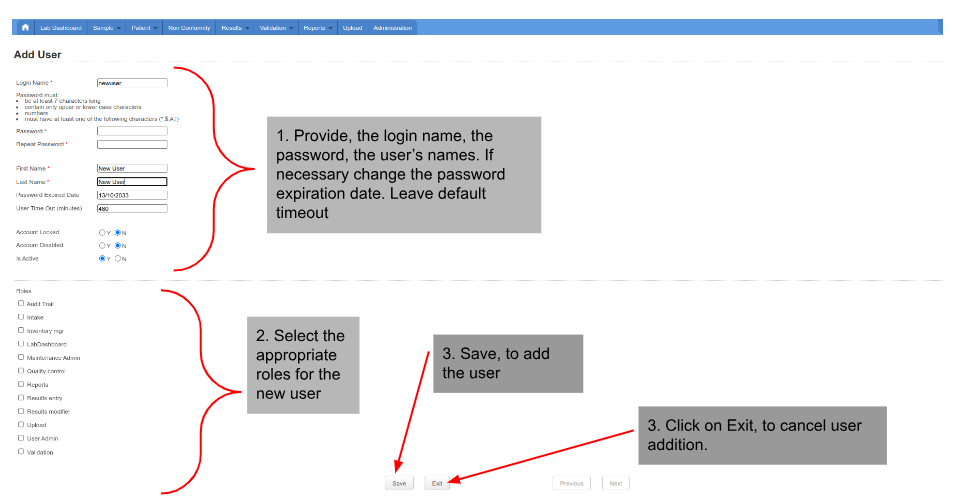

#### Updating Lab User's Information

To update an existing user’s information, select on the user to update on the user management page, then click on the edit button. This will direct you to the user management page. If an account is locked or disabled, the user can update the information and the account will be unlocked or activated. 


#### Deactivating User Account

To deactivate an existing user, on the user management page, select on the user to deactivate, then click on the deactivate button. 


#### Resetting User's Password

To update or reset a user’s password, on the user management page, select the user to reset or update password then click on the edit button. 

On the edit user information, provide the new user’s password and confirm the password, then save the form. The user information will be updated, and the password will be successfully updated. 


